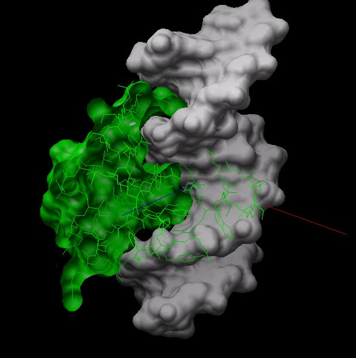

# DNA-Protein Binding

A DNA-binding protein was chosen from the [Protein Data Bank (PDB)][pdb] and the most
likely attachment site for its related stretch of DNA was sought using Python,
[FTDock][ftdock], and [Chimera][chimera].

*A cutaway view of the antennapedia protein bound to DNA*

The program FTDock performs a global search over all possible configurations, but this requires a large amount of computer time, or access to parallel computers. To make this approach more accessible, the FTDock program was adapted for iterative refinement, by starting at low resolutions, finding the best configurations, then exploring around these at a higher resolution.

FTDock handles rigid-body docking using shape and (optionally) electrostatic complementarity, using FFT and convolution to speed the searching (going from N2 to N logN). It is open source and written in C, and proved to be fairly easy to adapt. It was modified so that it could be called by a wrapper program, written in Python, which calls it at progressively higher levels of resolution.

FTDock was run with default parameters (gridsize 130, anglestep 12 degrees, noelec, total of 9240 angles to evaluate), which took 58 hours.

I modified FTDock to allow it to be called iteratively from another program, in this case a Python program that specifies the grid sizes and angle steps to iterate over. I also needed to limit the best configurations used to keep the protein from sticking onto the ends of the DNA. To do that I had to rotate the original PDB file so the axis of the DNA was aligned with the y-axis, then allow only configurations where abs(y) was within some limit (chose 20 angstroms). 

View.py is a Chimera code file that loads the original crystal structure, the best protein configuration for some iteration, xyz axes, the VRML cone markers, calculates an RMSD, and orients the complex to two good views and takes pictures (as png files). 

FTDock did not include code to assign charges to DNA, so had to add this to the assign_charges routine. 

The full report is [here](report/Report.pdf).

[pdb]: http://www.rcsb.org/pdb/home/home.do
[ftdock]: http://www.sbg.bio.ic.ac.uk/docking/ftdock.html
[chimera]: https://www.cgl.ucsf.edu/chimera/

